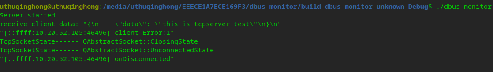
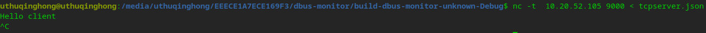

# 说明

This is a demo test for QTcpServer.

# 使用方式

使用qtcreator 打开工程，编译就会生成makefile文件

# 运行

直接使用Qt Creator调试运行。

运行结果：

sudo apt install netcat

开3个终端:

./dbus-monitor

终端2:

向10.20.52.105 9000端口发送数据，数据保存在tcpserver中

nc -t  10.20.52.105 9000 < tcpserver.json

终端3:

使用tcpdump监控发送的报文

sudo tcpdump -i any 'port 9000'

# 参考文档

[https://github.com/manfredipist/QTcpSocket/]()

[https://doc.qt.io/qt-5/qabstractsocket.html#disconnected]()

[https://stackoverflow.com/questions/52400159/reading-from-a-unix-domain-socket-qlocalsocket-on-qt]()

QTcpSocket使用过程中的一些问题记录

[https://blog.csdn.net/hbspring007/article/details/107316780]()
